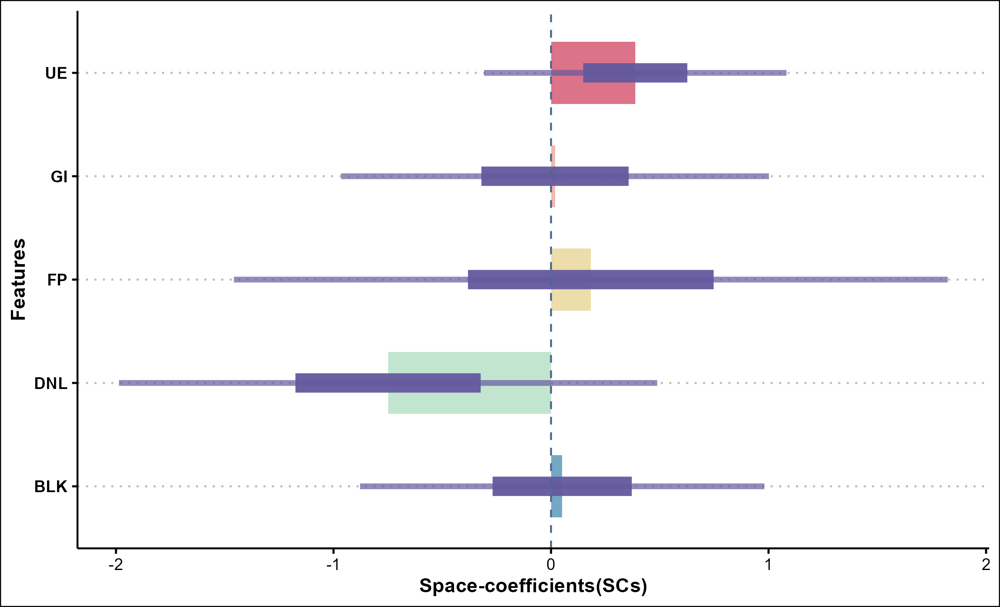

```{r setup, include=FALSE}
knitr::opts_chunk$set(
  message = FALSE,
  warning = FALSE,
  comment = "#>",
  eval = FALSE
  )
```

# Introduction of R package

{width="70%"}

**BSTVC R package: Spatiotemporal heterogeneous perspective for analyzing influencing factors, identifying key drivers, and making dynamic predictions, all within a unified 'full-map' framework.**

The BSTVC package offers a comprehensive and unified "full-map" geographic modeling framework designed to accurately capture spatiotemporal disparities in variable relationships. Its primary goal is to uncover spatiotemporal heterogeneous impacts of multiple explanatory variables on the target variable, i.e., spatiotemporal nonstationarity. The package is user-friendly, catering to the in-depth needs of professionals while lowering the barriers to complex Bayesian modeling. This makes advanced Bayesian local spatiotemporal regression methods accessible to a broader user community, enabling easier analysis and interpretation of complex spatiotemporal panel data. It is applicable across a wide range of disciplines, including but not limited to public health, medical geography, environmental health, health economics, and social medicine (Song and Tang, 2025).

## Theoretical foundation

Spatiotemporal heterogeneous coupling analysis simultaneously considers spatiotemporal heterogeneity and spatiotemporal autocorrelation based on the two geographic laws and combines temporal and spatial dimensions within the same framework for coupled analysis. This approach is the most comprehensive, precise and evidence-based analysis concept in current geographic data analysis, far exceeding the traditional non-spatial analysis, single spatial or temporal analysis, as well as the spatial-temporal separation analysis methods.The BSTVC R package, as a cutting-edge and up-to-date tool for the analysis of spatiotemporal heterogeneous coupling, is based on the following statistical mechanisms.

**Bayesian Spatiotemporally Varying Coefficients (BSTVC) model** is a class of local spatiotemporal regression based on Bayesian statistics ([\textcolor{blue}{\underline{Song et al., 2019}}](https://doi.org/10.1016/j.scitotenv.2018.08.114); [\textcolor{blue}{\underline{2020}}](https://doi.org/10.1080/19475683.2020.1782469); [\textcolor{blue}{\underline{2022}}](https://doi.org/10.1016/j.ijdrr.2022.103078)). A key advantage of this model is its ability to use a single "full-map" framework to uniformly capture spatiotemporal variations across all local regression coefficients. This enables precise identification of the spatiotemporal heterogeneous impacts of explanatory variables on the target variable, thereby revealing spatiotemporal nonstationarity. The Bayesian STVC series models, which currently include four sub-models (STVI, STIVI, STVC, and STIVC), offer a powerful tool for uncovering the complex spatiotemporal dynamics and influencing mechanisms affecting the target variable ([\textcolor{blue}{\underline{Song et al., 2022}}](https://doi.org/10.1016/j.ijdrr.2022.103078)).

**Bayesian Spatially Varying Coefficients (BSVC) model** is a simplified spatial version of the BSTVC model, designed to identify variable relationships with spatial heterogeneity, that is, spatial nonstationarity. Its advantage lies in integrating the "full-map" modeling framework of BSTVC, ensuring that the fitted local spatial regression coefficients are directly comparable. Spatial nonstationarity and spatiotemporal nonstationarity are important concepts derived from the second law of geography. Furthermore, both BSTVC and BSVC account for the characteristics of spatial and spatiotemporal autocorrelation, rooted in the first law of geography, when modeling nonstationarity.

**Spatiotemporal Variance Partitioning Index (STVPI)**, derived from the modeling results of BSTVC/BSVC, identifies key driving factors by quantifying and comparing the explainable percentages (spatiotemporal contribution/relative importance) of various spatiotemporal heterogeneous influencing factors ([\textcolor{blue}{\underline{Song et al., 2022}}](https://doi.org/10.1016/j.ijdrr.2022.103078); [\textcolor{blue}{\underline{Wan et al., 2022}}](https://doi.org/10.1016/j.jclepro.2022.133781)). Unlike mainstream methods that rely on absolute evaluation metrics for ranking factor importance, STVPI serves as a relative evaluation indicator, offering a significant prior foundation for geographic spatiotemporal attribution ([\textcolor{blue}{\underline{Wan et al., 2022}}](https://doi.org/10.1016/j.jclepro.2022.133781)).

## Advantages of BSTVC model

-   **"Full-map" framework**: This singleframework ensures the direct comparability of local spatiotemporal regression coefficients through a complete and unified Bayesian hierarchical modeling mechanism. The design of this framework enables the calculation of relative spatiotemporal contributions (STVPI). In contrast, under the frequentist statistical system, similar models are usually conducted through a "local separate modeling" approach, where individual models are built for each map unit and then combined, which may lead to a series of issues, such as insufficient comparability between different small models.

-   **Parameter uncertainty**: Whether it is the local prediction of the target variable or the local fitting of spatiotemporal regression coefficients, BSTVC can directly output the uncertainty assessment results of the parameters, including two Bayesian credible intervals (50% and 95%), presented in the form of wide and narrow intervals. However, in frequentist methods, similar models cannot assess uncertainty due to statistical mechanisms.

-   **Missing value friendly**: Even if the target variable Y has many spatiotemporal missing values, or the explanatory variable X has a few missing values, it does not affect the identification of spatiotemporal nonstationary effects. In contrast, similar models in frequentist methods usually do not support missing values.

-   **Support for more spatial weight matrices**: It supports not only distance-based and k-nearest neighbor spatial weight matrices but also 10-adjacency matrices to depict the spatial autocorrelation effects in the data. In contrast, similar analyses in frequentist methods usually do not support 10-adjacency matrices.

## Features of the R package

-   **Targeting multiple target variables**: It supports three mainstream types of target variables: continuous (log-Gaussian regression), binary (logistic regression), and count (Poisson regression), meeting the needs of different analytical scenarios.

-   **Detecting spatiotemporal heterogeneous impact mechanisms**: By fitting spatiotemporal regression coefficients, it reveals the local spatiotemporal disparities in relationships between various explanatory variables (Xs) and the target variable (Y), deeply analyzing the patterns of "adapting to local conditions and times," and exploring the impact mechanisms brought by spatiotemporal heterogeneity.

-   **Identifying key spatiotemporal drivers**: On the basis of identifying spatiotemporal heterogeneous impact mechanisms, it clarifies key driving factors by calculating the spatiotemporal explainable percentage, providing strong evidence for geographical spatiotemporal attribution.

-   **Improving spatiotemporal prediction accuracy**: Considering the spatiotemporal heterogeneity of local variable relationships, it significantly improves model fitting and prediction accuracy, which can be used for spatiotemporal missing value imputation, spatiotemporal smoothing, and future forecasting.

-   **Bayesian model evaluation**: It provides a comprehensive evaluation of Bayesian regression models, including model fitness (DIC, WAIC), complexity (pd), and prediction accuracy (LS) indicators, helping users fully understand model performance.

-   **Rich visual outputs**: It also provides a variety of spatiotemporal visualization tools and codes to help users intuitively understand model results, enhance the interpretability of data analysis, and promote innovation in your applied research.

# Installation of R package

## Installation from GitHub

Currently, this package only supports local installation from GitHub, and the installation method is as follows:

```{r eval=FALSE}
# Install using the devtools package
install.packages("devtools")                   # install the devtools package
devtools::install_github("songbi123/BSTVC")    # install the BSTVC package

# Install using the remotes package
install.packages("remotes")                   # install the remotes package
remotes::install_github("songbi123/BSTVC")    # install the BSTVC package
```

## Install dependency packages

When installing the BSTVC package in RStudio, the system will prompt you to install additional R packages that come with it. However, since the dependency package INLA is a larger installation package, installing the BSTVC package may result in failure. To avoid this issue, we provide a separate method for installing the INLA package for your reference. If the installation of the `BSTVC` package in the previous step failed, please install the `BSTVC` package after successfully installing the `INLA` package. If you have already installed the `INLA` package when installing the `BSTVC` package, you can skip this step.

```{r}
## Install the INLA package，more information can be found at 
## <https://www.r-inla.org/download-install>
options(timeout = 300)  # Extend the timeout to 5 minutes
install.packages("INLA",repos=c(getOption("repos"),INLA="https://inla.r-inla-down
                                load.org/R/stable"), dep=TRUE)

## Or use an older version of INLA, you can download the compressed package of INLA 
## to your local and install it.
```

**[Note]**: When manually installing the INLA package, please ensure that the version of the INLA package is compatible with your R version. If your R version has been updated to the latest, there may be no INLA package compatible with this version of R, which may result in installation failure. In addition, please ensure that your R version is 4.4.1 or higher before installing the BSTVC package.

Reference: The R version used for the development of the BSTVC R package (V *25.1.28*) is *4.4.1*, and the installed INLA package version is *24.06.27*.

## Load the BSTVC package

You can load it directly after successful installation.

```{r}
library(BSTVC)
```

# Function BSTVC to construct Bayesian local spatiotemporal regression

## Import spatiotemporal panel data

This tutorial uses the example data provided with the BSTVC package for data import, and users can perform corresponding operations based on their own data.

Two types of data files need to be loaded: one is the table file containing all variables, and the other is the `sf` format `shapefile` file containing the unique value field of the geographical unit. Note that if the data contains multiple time sections, the final table data used for modeling should be adjusted to the spatiotemporal panel format (i.e., long data format) to support spatiotemporal panel data analysis.

In the `data-raw/Data_Preproc.R` file of the R package, it is publicly shown how to load the source files of table data and map data files (shp format), and how to convert table data into the spatiotemporal panel data format that can be run by the BSTVC model. Users can refer to the example code in this file and apply the same transformation to their own datasets.

The example dataset `Florida_NAT` shows the style of the transformed data, and users can use `data(Florida_NAT)` to load the example data for reference. In addition, for the method of converting cross-sectional data into spatiotemporal panel data, users can refer to the `melt` function in the `reshape2` package, the `pivot_longer` function in the `tidyr` package, etc., and there are more than one method.

```{r}
## Load example data
# The table file containing all variables used (already in spatiotemporal panel data format)
data(Florida_NAT)
# The sf format shapefile file containing the unique value field of the geographical unit
data(Florida_Map)

# You can use class() to check the data type
class(Florida_NAT)
class(Florida_Map)

## Users can refer to the following methods to import their own data, 
## but please note the data type
# The detailed steps for loading data and the detailed code 
# for transforming data are given in "data-raw/Data_Preproc.R"
# data <- read.csv("NAT.csv")
# data <- openxlsx::read.xlsx("NAT.xlsx")

## Load shapefile data, it is recommended to use the st_read function 
## in the sf package for import
# The type of the imported map should be sf
# map <- sf::st_read("NAT.shp")

# class(data)
# class(map)
```

**[Note]**: In the spatiotemporal panel data supported by BSTVC, variable Y can contain missing values, and variable X can also tolerate a few missing values, represented by NA.

After users import their own spatiotemporal panel data and map data, they need to check the field types of the two types of data. Specifically, the following points need to be ensured:

1.  The field in the data frame representing the year should be of numeric type.

2.  The field representing the unique identifier of the spatial unit should be of the correct data type (numeric or character).

3.  The field type representing the unique identifier of the spatial unit in the map data should be correct and consistent with the field name and type in the data frame.

Ensuring that the types of key fields are correct and consistent can avoid errors during the modeling process. You can use the `str()` function to check the field types, as shown below:

```{r}
# In the example data, the `Year` field represents the time field of this spatiotemporal panel 
# data, and `FIPS` represents the unique identifier field of each county in Florida
# And the Florida_Map data must have the same FIPS field
str(Florida_NAT)
str(Florida_Map)

# If you need to change the field data type, you can use functions such as `as.numeric()`,
# `as.character()` for conversion
```

In addition, it is also necessary to check whether the order of the key fields (i.e., the fields representing the unique values of each spatial unit) in the data table is completely consistent with the order of the key fields in the map data. Inconsistency can cause the final results to be incorrect, but the model will not report an error. For example, if the order of the FIPS field representing the county unit in Florida_Map is 12063, 12059, 12131, 12133, 12089, then the FIPS field in the Florida_NAT data must also be in this order.

For this situation, you can call the `data.check()` function in the package for inspection. For spatiotemporal panel data, the `data.check()` function includes 4 parameters, namely:

-   data: The imported data table, which must contain the fields representing time and the unique identifier of the spatial unit.
-   study_map: The imported sf format map data, which must also contain the field representing the unique identifier of the spatial unit.
-   Time: The field representing time in the data, enter the string, i.e., the column name of the time field.
-   Space: The field representing the unique identifier of the spatial unit in both data and study_map, enter the string.

```{r}
# You can also use `?data.check` in R to view the help documentation for this function
newdata <- data.check(data = Florida_NAT,
                      study_map = Florida_Map,
                      Time = "Year",   ## Enter the string, no need for the vector data
                      Space = "FIPS")

## If the order of spatial units completely matches, the function will end with message, 
## and the output `newdata` will be the same as the `data` input to the function;
# If the order is inconsistent, the output `newdata` will be the newly matched data;
```

## Preprocessing of spatiotemporal explanatory variables

Before regression modeling, processing the explanatory variables (X variables) is a crucial step. Users can choose not to preprocess the X variables at all, or perform logarithmic (log) transformation or standardization (standardization) processing.

We **strongly recommend** performing **standardization** processing on the X variables for the following reasons:

-   **Standardization Processing**: Standardized X variables ensure that all indicators are compared on the same scale, which helps to measure the contribution of each variable to the model.

-   **Improve Computational Efficiency**: Standardizing X variables can also speed up the computational process of the model.

**[Note]**: For continuous data, since the model internally uses a log-Gaussian prior, the target variable Y will be automatically log-transformed, so there is no need to perform a log transformation on Y, simply input the raw data. For count and binary Y variables, no transformation is needed.

```{r}
# Standardize the explanatory variables in the example data
Florida_NAT[c("DNL","UE","FP","BLK","GI")] <- scale(Florida_NAT[c("DNL","UE","FP","BLK","GI")])

# After preparing all the data, you can proceed to the next step of BSTVC function modeling
```

**[Note]**: There is no strict order of operation for preprocessing the explanatory variables X and data checking.

## BSTVC function

The main modeling function provided in the BSTVC package is the `BSTVC()` function, which stands for Bayesian Spatiotemporal Varying Coefficients modeling. This function has eight main parameters, described as follows:

-   **formula**: The model formula, with the basic format `Y ~ ST(X1 + X2 + X3)`, is used to specify the target and explanatory variables in the modeling. In the BSTVC function, all explanatory variables X must be placed within the `ST()` symbol, indicating that these explanatory variables have both spatial and temporal non-stationarity (currently, only this situation is supported).
-   **data**: A data frame containing all variables used in the model. If the data involves multiple time sections, it must be in spatiotemporal panel data format. The order of spatial units under each time section must be completely consistent with the order of geographical units in the shapefile.
-   **study_map**: Data in sf format, imported from `shapefile` (*shp*) format map data, which includes unique value fields for each geographical unit as well as geometric attribute information, etc.
-   **Time**: A string specifying the time field in the data frame. Only the column name of the time field (as a string) is needed.
-   **Space**: A string specifying the unique identifier field for spatial units in the data frame. Ensure that the string parameter matches exactly with the column name in the data frame, and that both the *data* and *study_map* have a field with this string name.
-   **response_type**: A string indicating the type of modeling data, currently supporting three application scenarios: "continuous" for continuous Y variables; "binary" for binary Y variables, where 0 indicates non-occurrence and 1 indicates occurrence; "count" for count Y variables.
-   **threads**: The number of threads, with a default of 6, which can be set manually.
-   **spatial_matrix**: The spatial weight matrix, with a default of the 10-adjacency matrix. Users can input their own constructed spatial weight matrix file, supporting various types of spatial weight matrices such as k-nearest neighbor, inverse distance, fixed distance, etc.; if the user does not input, the function will help calculate the binary spatial weight matrix under the QUEEN rule (assign a value of 1 for adjacent relationships, otherwise assign a value of 0).

```{r}
## BSTVC function modeling — Continuous type
# Modeling for continuous spatiotemporal data, where Y is continuous, 
# using the HR (homicide rate) field in the example data
## Specify the time field as "Year", the spatial field as "FIPS", 
## and set the response_type parameter to "continuous"
# The default spatial_matrix parameter is NULL, i.e., the 10-adjacency matrix
model_1 <- BSTVC(formula = HR~ST(DNL+UE+FP+BLK+GI),
                 data = Florida_NAT,
                 study_map = Florida_Map,
                 Time = "Year",
                 Space = "FIPS",
                 response_type = "continuous",
                 threads = 6,
                 spatial_matrix = NULL)


## BSTVC function modeling — Count type
# Y is count data, using the HC (homicide count) field in the example data for modeling
# Modify the Y variable and set the response_type parameter to "count"
model_2 <- BSTVC(formula = HC~ST(DNL+UE+FP+BLK+GI),
                 data = Florida_NAT,
                 study_map = Florida_Map,
                 Time = "Year",
                 Space = "FIPS",
                 response_type = "count",
                 threads = 6,
                 spatial_matrix = NULL)


## BSTVC function modeling — Binary type
# Y is binary data, using the HW (1 if a homicide occurs, otherwise 0) field 
# in the example data for modeling
# Modify the Y variable and set the response_type parameter to "binary"
model_3 <- BSTVC(formula = HW~ST(DNL+UE+FP+BLK+GI),
                 data = Florida_NAT,
                 study_map = Florida_Map,
                 Time = "Year",
                 Space = "FIPS",
                 response_type = "binary",
                 threads = 6,
                 spatial_matrix = NULL)
```

## BSTVC model results

The BSTVC function outputs a total of six parts. The specific output parts are described as follows:

| Output Result | Description |
|-------------------------|----------------------------------------------|
| **model.evaluation** | Overall evaluation results of the Bayesian model, including commonly used assessment indicators such as DIC, WAIC, LS, etc.; |
| **local.prediction** | Local spatiotemporal prediction results for the target variable Y, along with wide (95%) and narrow (50%) Bayesian credible intervals for each prediction value to express uncertainty; |
| **summary.random.effects** | Results of random effects, including spatial and temporal random effects for each explanatory variable, as well as their wide (95%) and narrow (50%) Bayesian credible intervals; |
| **time.coefficients** | Time-coefficients (TCs, temporal nonstationarity) in wide data format, including temporal regression coefficients for each time slice of the explanatory variables and their wide (95%) and narrow (50%) Bayesian credible intervals; |
| **space.coefficients** | Space-coefficients (SCs, spatial nonstationarity) in wide data format, including spatial regression coefficients for each map unit of the explanatory variables and their wide (95%) and narrow (50%) Bayesian credible intervals; |
| **STVPI** | Results of the Spatiotemporal Variance Partitioning Index (STVPI) calculation, which can quantify the spatiotemporal contribution percentage of each explanatory variable, not only obtaining the spatiotemporal ranking of factor importance but also assessing relative importance. For more information on this tool, please refer to [\textcolor{blue}{\underline{Wan et al., 2022}}](https://doi.org/10.1016/j.jclepro.2022.133781); |

Each part of the output result from the main function BSTVC is a data frame that users can directly extract and save or use for subsequent result visualization. Taking the `model_1` from the three example models returned above as an example, it is as follows:

```{r}
# Extract data
# Local unit prediction results (all units)
predict <- model_1$local.prediction # This data is also in spatiotemporal panel format
# Temporal regression coefficients
time.coef <- model_1$time.coefficients
# Spatial regression coefficients
space.coef <- model_1$space.coefficients

## The spatial regression coefficient data is in cross-sectional data format, 
## which can be directly saved as csv or xlsx format after extraction,
## and used to draw coefficient distribution maps in professional mapping software 
## such as ArcGIS, ArcGIS Pro, etc., as follows:
write.csv(space.coef,"Spatial Regression Coefficients.csv")
```

## Visualization of BSTVC model results

In this document, we will provide a series of steps and code examples for drawing model output results so that you can easily create various charts in the R environment. Our goal is to enable you to not only understand the model output but also present these complex data in a more intuitive and attractive way through charts. We believe that with the help of this document, you will be able to use and master our R package more confidently and skillfully, and play a greater role in your data analysis work.

All charts and visualization results shown in this part of the document are based on the output of the `model_1` model built with example data. The following plotting code and figures are for reference.

```{r}
# Load plotting R packages
library(ggplot2)
library(dplyr)
library(ggthemes)
library(forestplot)
library(ggbeeswarm)
library(tidyr)
```

### Bayesian model evaluation

The Bayesian evaluation of the model includes indicators such as model name (including the start time of modeling), DIC, LS, WAIC, pd2, etc. Among them, *DIC* and *WAIC* represent model fit, *pd* represents model complexity, and *LS* represents predictive accuracy.

```{r BSTVC model eval, eval=FALSE}
# Extract Bayesian evaluation results from the function output.
model.eval <- model_1$model.evaluation
# Display model evaluation results
model.eval
# Transpose the data frame for indicator display
t(model.eval)
# Save model evaluation results to local
write.csv(model.eval, "results of model evaluation.csv")
```

{width="100%"}

### Spatiotemporal prediction of the target variable

For all missing or non-missing values of the target variable Y in the data, the local prediction results will output predicted values, as well as wide and narrow Bayesian credible intervals for the predicted values to directly evaluate uncertainty.

```{r BSTVC local pred}
# Extract local prediction data frame
predict <- model_1$local.prediction
# View output fields
str(predict)
```

{width="80%"}

Among them, for the local prediction results of all types of variable Y (continuous, count, and binary), the first two fields in the output data frame are the time field and space field in the modeling data `data`, the `y` field represents the original value of the target variable Y, the `fill_y` field represents the complete field after predicting and filling the missing values of the target variable Y, and `predict_y` represents the model predicted value for all units.

**[Note]**: For continuous variable Y, since the model sets a log-Gaussian prior distribution, the target variable Y will be automatically log-transformed, so we have re-transformed the output results and set the "predict_" prefix. Therefore, `(predict_0.025quant, predict_0.975quant)` is the wide credible interval for the predicted values, and `(predict_0.25quant, predict_0.75quant)` is the narrow credible interval for the predicted values;

**[Note]**: For the prediction output results of the other two types of Y (binary and count), no transformation is made to the target variable Y. Therefore, the output `(y_0.025quant, y_0.975quant)` is the wide credible interval for the predicted values, and `(y_0.25quant, y_0.75quant)` is the narrow credible interval for the predicted values.

In addition, based on the results of local prediction, the evaluation of mainstream prediction accuracy (such as scatter plots, R2, RMSE, etc.) can be carried out. Taking the continuous modeling results as an example, we provide the code for drawing scatter plots and calculating R2 and RMSE:

```{r}
## Based on the original values and predicted values of Y, draw a scatter plot
(p1 <- ggplot(predict, aes(x = y, y = predict_y)) +
  # Draw the diagonal line
  geom_abline(slope = 1, intercept = 0, color = "red", size = 1, linetype = "dashed") +
  geom_point(aes(fill = y), size = 2.5, shape = 22, color = "white") +
  scale_fill_gradient(low = "#88d8db", high = "#b8aeeb") +
  labs(x = "Measured Values", y = "Predicted Values") +
  theme_few() +
  theme(
    text = element_text(family = "serif", face = "bold"),
    axis.text = element_text(family = "serif", size = 12, face = "bold"),
    legend.position = "none",
    axis.title = element_text(size = 12)
  )
)
```

{width="70%"}

```{r}
## Calculate predictive accuracy metrics based on the original and predicted values of Y
# Extract the part without missing values for metric calculation
predict <- predict %>% filter(!is.na(.$y))
# Manually calculate evaluation metrics: coefficient of determination (R²), 
# and root mean square error (RMSE)
R2 <- 1 - ((sum((predict$predict_y - predict$y)^2)) / (sum((mean(predict$y) - predict$y)^2)))
RMSE <- sqrt(mean((predict$predict_y - predict$y)^2))
```

### Spatiotemporal contributions of influencing factors

The Spatiotemporal Variance Partitioning Index (STVPI) aims to quantify and compare the explainable percentages of different spatiotemporal heterogeneous influencing factors, clarifying key driving factors by calculating the spatiotemporal contribution. Based on the BSTVC modeling results, STVPI further decomposes the total variance of each explanatory variable into two independent components, temporal nonstationarity random effects, and spatial nonstationarity random effects, thereby revealing the sources of spatiotemporal variation in the data.

The advantages of this tool are:

1.  It can not only identify the overall spatiotemporal contribution of explanatory factors but also their contributions in the temporal and spatial dimensions separately;
2.  Compared to mainstream methods that can only identify the absolute contribution ranking (such as random forests, SHAP, etc.), STVPI identifies relative contributions (explainable percentages), providing an important evidential basis for geographical spatiotemporal attribution;
3.  It directly evaluates its uncertainty (Bayesian wide and narrow credible intervals);

```{r BSTVC STVPI}
# Extract STVPI results from the model output
STVPI.data <- model_1$STVPI

# Extract plotting data
## This example is for plotting continuous results, 
## if counting or binary, remove "space.time.all", "residual" fields
random.effects <- c(
  "space.time.all", "residual", # Model explainability and residual
  "space.all", "time.all", # Total contribution of time or space
  "space.DNL","space.UE","space.FP","space.BLK","space.GI", # Spatial contribution of each X
  "time.DNL", "time.UE", "time.FP", "time.BLK", "time.GI", # Temporal contribution of each X
  "space.time.DNL", "space.time.UE", "space.time.FP", "space.time.BLK", "space.time.GI"
) # Spatiotemporal contribution of each X

# Filter data and group data for subsequent plotting
plot.data <- as.data.frame(STVPI.data[STVPI.data$`random effects` %in% random.effects, ]) %>%
  mutate(Group = case_when(
    `random effects` %in% random.effects[1:2] ~ "Overall",
    `random effects` %in% random.effects[3:4] ~ "Space & Time",
    `random effects` %in% random.effects[5:9] ~ "space",
    `random effects` %in% random.effects[10:14] ~ "time",
    `random effects` %in% random.effects[15:19] ~ "space - time"
  )) %>% 
  filter(Group != "NA")

# Reverse the display order of factors
plot.data$`random effects` <- factor(plot.data$`random effects`,levels = rev(random.effects))

# Plot STVPI
(p2 <- ggplot(plot.data, aes(x = STVPI_mean, y = `random effects`, group = Group)) +
  geom_errorbarh(aes(xmin = `STVPI_2.5%`, xmax = `STVPI_97.5%`, 
                     colour = `random effects`), 
                 height = 0, linewidth = 1.8, alpha = 0.3, linetype = "solid") +
  geom_errorbarh(aes(xmin = `STVPI_25%`, xmax = `STVPI_75%`, 
                     colour = `random effects`), 
                 height = 0, linewidth = 1.8, alpha = 0.6, linetype = "solid") +
  geom_point(aes(colour = `random effects`), shape = 21, 
             fill = "white", size = 1.8, alpha = 1) +
  labs(title = "", x = "STVPI", y = "") +
  facet_wrap(~Group, scale = "free", ncol = 3) +
  theme_few() +
  scale_x_continuous(labels = scales::percent_format()) +
  theme(legend.position = "none"))
```

{width="100%"}

**[Note]**: The Poisson-BSTVC (count type) and logistic-BSTVC (binary type) models currently do not include a residual term, so STVPI cannot calculate the overall model's explainable percentage. Therefore, when plotting, you need to remove the "space.time.all", "residual" fields from the `random.effects` variable, as well as the "Overall" field from the `plot.data` variable.

### Time-coefficients (temporal nonstationarity)

The BSTVC model can not only calculate time-coefficients (TCs) to characterize the temporal heterogeneity of variable relationships but also estimate each regression coefficient's Bayesian wide (95%) and narrow (50%) credible intervals for directly evaluating the uncertainties of the results.

```{r BSTVC time coef}
# Extract temporal regression coefficients from the model results and 
# add coefficient fields and credible interval fields
Time.Coef <- model_1$time.coefficients %>%
  mutate(
    Coefficients = round(mean, 2),
    `95%CI` = paste0("(", round(`0.025quant`, 2), " - ", round(`0.975quant`, 2), ")")
  )

# Convert the time field to years (optional)
Time.Coef <- Time.Coef %>% mutate(Year = case_when(
  time_index == 1 ~ 1960,
  time_index == 2 ~ 1970,
  time_index == 3 ~ 1980,
  time_index == 4 ~ 1990
))

# Add table header
new.Time.Coef <- rbind.data.frame(colnames(Time.Coef), Time.Coef)
new.Time.Coef[1, c("mean", "0.025quant", "0.975quant")] <- NA

## Forest plot display of temporal regression coefficients
(p3 <- forestplot(new.Time.Coef[, c(9, 12, 10, 11)],
  mean = new.Time.Coef$Coefficients,
  lower = new.Time.Coef$`0.025quant`,
  upper = new.Time.Coef$`0.975quant`,
  graph.pos = 4, 
  xlab = "Time-coefficients(TCs)",
  is.summary = c(T, rep(FALSE, nrow(Time.Coef))),
  align = "c",
  graphwidth = unit(4, "cm"),
  xticks = (c(-1.5, -0.6, 0, 0.6, 1.2)),
  col = fpColors(lines = "#ffb07c", box = "#a83e4c"),
  hrzl_lines = list(
    "2" = gpar(col = "#4e5180"), "6" = gpar(col = "#4e5180"), "10" = gpar(col = "#4e5180"),
    "14" = gpar(col = "#4e5180"), "18" = gpar(col = "#4e5180")
  ),
  txt_gp=fpTxtGp(label=gpar(cex=1.25),
                 ticks=gpar(cex=1.1),
                 xlab=gpar(cex = 1.5),
                 title=gpar(cex = 1.2)),
  lineheight = unit(1, "cm"),
  boxsize = 0.15,
  ref_line = 0
))

## Temporal regression coefficients time series display form 
## (second type of plotting, for reference)
# (p3 <- ggplot(data=Time.Coef,aes(x=Year,y= Coefficients ,fill=explain_variable))+
#   geom_ribbon(aes(ymin=`0.025quant`,ymax=`0.975quant`,fill=explain_variable),alpha=0.1)+
#   geom_ribbon(aes(ymin=`0.25quant`,ymax=`0.75quant`,fill=explain_variable),alpha=0.5)+
#   geom_line(aes(x=Year,y= Coefficients,colour=explain_variable),alpha=0.8)+
#   facet_wrap(~explain_variable,scale = "free_y")+
#   theme_few()+
#   labs(title=NULL, x="Time dimension", y="Time-coefficients (TCs)")
#   )
```

{width="70%"}

### Space-coefficients (spatial nonstationarity)

Similar to TCs, the BSTVC model can not only calculate space-coefficients (SCs) to represent the spatial heterogeneous relationships of variables but also estimate their uncertainties, that is, Bayesian wide (95%) and narrow (50%) credible intervals.

#### Plotting SCs Maps

After extracting the SCs data frame from the model output, it is recommended to plot it using professional map drawing software such as ArcGIS or ArcGIS Pro. Here, based on the R language, a simple basic spatial regression coefficient map display result is drawn for reference only.

```{r BSTVC space coef}
# Extract spatial regression coefficients from the model output
Space.Coef <- model_1$space.coefficients

# Combine the geometric attributes of the map with the spatial regression coefficients 
# of each geographical unit
Space.Coef.merge <- merge(Florida_Map, Space.Coef, by = "FIPS", all.x = T)

# Convert cross-sectional data to panel data format
Space.coef.panel <- Space.Coef.merge %>%
  pivot_longer(
    cols = paste0(c("DNL", "UE", "FP", "BLK", "GI"), "_mean"),
    names_to = "variable",
    values_to = "SCs"
  ) %>%
  select(c(1:9, 45:47))

# Plot the map
(p4 <- ggplot() +
  geom_sf(data = Space.coef.panel, aes(group = variable, fill = SCs)) +
  facet_wrap(~variable, shrink = F, drop = F) +
  scale_fill_gradient(low = "#d9f1e6", high = "#4e5180", name = "Space-coefficients (SCs)") +
  theme_few() +
  theme(legend.position = c(.85, .25))
)
```

{width="99%"}

#### Plotting the impacts of factors within a single spatial unit

Following the SHAP plotting paradigm, this plot shows the factor impact effect of a single spatial unit. The graph is a combination of two types of plots:

-   Horizontal bar chart: Each horizontal bar represents the spatial regression coefficients of different explanatory variables X for a certain spatial unit;
-   Line plot: The lines superimposed on the bar chart indicate the wide (95%) and narrow (50%) Bayesian credible intervals of these regression coefficients.

This visualization method helps to intuitively understand the spatial heterogeneity of the impact of different spatial units on the target variable and estimate the range of uncertainty of the coefficients. The following is the R code for plotting the spatial regression coefficients of a single spatial unit, and the R code for batch plotting the factor impact effect diagrams of multiple spatial units can refer to the latter part of this section.

```{r}
# Extract X names
name.X <- gsub("_mean", "", names(Space.Coef[, c(2, 10, 18, 26, 34)]))

# Manually process data # Convert to plotting data (spatiotemporal panel data format)
SC <- list()
for (name in c("mean", "0.025quant", "0.25quant", "0.75quant", "0.975quant")) {
  SC[[name]] <- Space.Coef %>% 
    pivot_longer(cols = paste0(c("DNL", "UE", "FP", "BLK", "GI"), "_", name), 
                 names_to = "feature", values_to = name)
}

# Combine plotting data
impact_data <- cbind.data.frame(
  feature = rep(name.X, times = nrow(Space.Coef)), # variable
  SC$mean$FIPS,
  SC$mean$mean, SC$`0.025quant`$`0.025quant`, SC$`0.25quant`$`0.25quant`, 
  SC$`0.75quant`$`0.75quant`, SC$`0.975quant`$`0.975quant`
) %>%
  `colnames<-`(c("feature", "FIPS", "mean", "0.025quant", "0.25quant", 
                 "0.75quant", "0.975quant"))

## Plot the factor impact effect of a certain spatial unit
# Extract spatial regression coefficients with the unique value field "12133"
single_data <- impact_data %>% filter(FIPS == 12133)
# Plotting
(p5 <- ggplot(data = single_data)+
  geom_bar(
    aes(x = mean, y = feature, fill = feature),
    stat = "identity", width = 0.6)+
  geom_segment(aes(x = `0.025quant`, y = feature,
                   xend = `0.975quant`, yend = feature), 
               color="#63599d",size = 1.5,alpha=.7)+
  geom_segment(aes(x = `0.25quant`, y = feature,
                   xend = `0.75quant`, yend = feature),
               color="#63599d",size = 5,alpha=.95)+
  # Add horizontal reference line
  geom_vline(xintercept = 0, linetype = "dashed", size = 0.5, color = "#4e6886") +
  scale_fill_manual(values = c("#74a9c5", "#c2e5cf", "#edddab", "#f2b8ae", "#dd7389")) +
  scale_color_manual(values = c("#74a9c5", "#c2e5cf", "#edddab", "#f2b8ae", "#dd7389")) +
  theme_clean()+
  labs(x="Space-coefficients(SCs)",y="Features")+
  theme(
    axis.text.y = element_text(size = 9, face = "bold"),
    axis.title.x = element_text(size = 11, face = "bold"),
    axis.title.y = element_text(size = 11, face = "bold"),
    legend.position = "none")
  )
```

{width="80%"}

```{r}
## Plotting the factor impact effect of multiple spatial units
# Randomly extract spatial regression coefficients of 12 spatial units
multi_data <- impact_data[impact_data$FIPS %in% sample(unique(impact_data$FIPS),12),]
# Plotting
(p6 <- ggplot(data = multi_data,
              aes(x = mean, y = feature, fill = feature))+
  geom_bar(stat = "identity", width = 0.6)+
  geom_segment(aes(x = `0.025quant`, y = feature,
                   xend = `0.975quant`, yend = feature), 
               color="#63599d",size = 1,alpha=.7)+
  geom_segment(aes(x = `0.25quant`, y = feature,
                   xend = `0.75quant`, yend = feature),
               color="#63599d",size = 4,alpha=.95)+
  # Add horizontal reference line
  geom_vline(xintercept = 0, linetype = "dashed", size = 0.5, color = "#4e6886") +
  scale_fill_manual(values = c("#74a9c5", "#c2e5cf", "#edddab", "#f2b8ae", "#dd7389")) +
  scale_color_manual(values = c("#74a9c5", "#c2e5cf", "#edddab", "#f2b8ae", "#dd7389")) +
  facet_wrap(~FIPS, scale="free",ncol=4)+
  theme_clean()+
  labs(x="Space-coefficients(SCs)",y="Features")+
  theme(
    axis.text.y = element_text(size = 9, face = "bold"),
    axis.title.x = element_text(size = 11, face = "bold"),
    axis.title.y = element_text(size = 11, face = "bold"),
    legend.position = "none")
  )
```

{width="100%"}

#### Combination of bee swarm and bar plot for SCs 

Following the SHAP plotting paradigm, this plot displays the distribution of spatial regression coefficients for each variable in the model. Each row represents a different explanatory variable, and each point corresponds to the spatial regression coefficient of that variable in each spatial unit:

-   Distribution of points: The scatter points in the plot represent the spatial regression coefficients of each spatial unit, revealing the variability in the degree and direction of influence of the variable in space.

-   Average value bar chart: The bar chart below each variable shows the average value of all spatial regression coefficients for that variable (i.e., representing the global spatial regression coefficient), and the color intensity of the bar chart indicates the direction of the average coefficient's impact, providing an intuitive understanding of the overall influence of the variable.

```{r include=TRUE}
# Manually create histogram data
bar_data <- data.frame(
  feature = rep(name.X, each = nrow(Space.Coef)), # Variables
  # Local spatial regression coefficients
  coef_value = c(Space.Coef$DNL_mean, Space.Coef$UE_mean, Space.Coef$FP_mean, 
                 Space.Coef$BLK_mean, Space.Coef$GI_mean)
) %>%
  group_by(feature) %>%
  summarise(
    mean = mean(coef_value),
    abs_mean = mean(abs(coef_value))
  )

# Manually create bee swarm plot data
beeswarm_data <- data.frame(
  feature = rep(name.X, each = nrow(Space.Coef)), # Variables
  # Local spatial regression coefficients
  coef_value = c(Space.Coef$DNL_mean, Space.Coef$UE_mean, Space.Coef$FP_mean, 
                 Space.Coef$BLK_mean, Space.Coef$GI_mean)
)

# Plot the combination chart
(p7 <- ggplot() +
  ## Plot the average spatial regression coefficients (global spatial regression coefficients)
  geom_bar(
    stat = "identity", data = bar_data,
    aes(x = mean, y = feature, fill = mean < 0), width = 0.6
  ) +
  scale_fill_manual(values = c("#EBB3BE", "#C0D6EA")) +
  # Add horizontal reference line
  geom_vline(xintercept = 0, linetype = "dashed", size = 0.5, color = "#4e6886") +

  ## Plot the distribution of local spatial regression coefficients
  geom_beeswarm(
    data = beeswarm_data,
    aes(x = coef_value, y = feature, colour = coef_value), alpha = 0.5, 
    cex = 1, shape = 16, size = 3, priority = "descending"
  ) +
  scale_colour_gradient2(low = "#4e6886", mid = "#eed8db", high = "#bb616d", 
                         midpoint = 0, name = NULL) + # Gradient colors
  geom_text(
    data = bar_data, aes(x = mean, y = feature, label = round(mean, 3)),
    size = 3,
    color = "black"
  ) + # Add values on top of bars
  theme_clean() +
  theme(
    plot.title = element_text(hjust = 0.5, color = "purple"),
    axis.text.y = element_text(size = 9, face = "bold"),
    axis.title.x = element_text(size = 11, face = "bold"),
    axis.title.y = element_text(size = 11, face = "bold"),
    legend.position = "none"
  ) +
  labs(
    title = NULL,
    x = "Space-coefficients(SCs)",
    y = "Feature"
  ))
```

{width="80%"}

# Function BSVC to construct Bayesian local spatial regression

Compared with the Bayesian Spatiotemporal Varying Coefficients (BSTVC) model, the main difference of the Bayesian Spatial Varying Coefficients (BSVC) model is that the BSVC model does not consider the nonstationarity on the temporal dimension.

**In this case, we will additionally demonstrate how to construct a custom spatial weight matrix to define the characteristics of spatial autocorrelation.** The default spatial weight matrix is based on the 10-adjacency matrix of areal spatial units, and users do not need to customize it (as shown in **Part 3** of this document).

## Import spatial cross-sectional data

Since the BSVC model is mainly suitable for scenarios that focus on spatial effects without considering temporal changes, there is no need to import data from multiple time nodes (e.g., n years), only a single time slice of data (in the same format as cross-sectional data) is required. In this example, we extracted the last year of data from the example data as the input for the BSVC model. For your own data, you can use the same data import method in the BSTVC function.

```{r}
data <- Florida_NAT[Florida_NAT$Year == 1990,]
```

**[Note]**: In the BSVC model, variable Y can contain missing values, and variable X can also tolerate a few missing values, represented by NA.

After users import their own data (a single time slice of spatiotemporal panel data or cross-sectional data) and map data, they need to check the types of fields in both types of data. Specifically, the following points need to be confirmed:

1.  Whether the field representing the year in the data frame is of `numeric` type;
2.  Whether the field representing the unique identifier of the spatial unit is of the correct data type (`numeric` or `character`);
3.  Whether the type of the field representing the unique identifier of the spatial unit in the map data is correct, and consistent with the name and type of the field in the data frame.

Ensuring that the types of key fields meet the requirements and that the types of the same fields in both types of data are consistent can effectively avoid errors during the modeling process. You can use the `str()` function to check the field types, as shown below:

```{r}
## In the example data, the `Year` field represents the time field of this spatiotemporal panel 
## data, and `FIPS` represents the unique identifier field of each county in Florida,
## and Florida_Map data must contain the same FIPS field
str(data)
str(Florida_Map)

# If you need to change the field data type, you can use functions such as `as.numeric()`,
# `as.character()` for conversion
```

For data used in BSVC modeling, it is still necessary to ensure that the order of key fields in the data table (i.e., the fields representing the unique values of each spatial unit) is completely consistent with the order of key fields in the map data. In addition, even if the data has no temporal dimension, the `data.check()` function can also be used to check the matching of spatial unit order. The required parameters include `data`, `study_map`, `Time`, and `Space`, as shown in the following example:

**Please note that even if the input is spatial data, the `Time` parameter (the field representing time in the data) is still necessary.**

```{r}
newdata <- data.check(data = data,
                      study_map = Florida_Map,
                      Time = "Year",   # Enter string, no need for vector data
                      Space = "FIPS")

# If there is no time field in your own data, you can add one manually, for example:
# data["year"] <- rep(1,each=nrow(data))  # Add a year field with all values as 1
```

## Preprocessing of spatial explanatory variables

Before regression modeling, processing the explanatory variables (X variables) is a crucial step. Users can choose not to preprocess the X variables at all, or perform logarithmic (log) transformation or standardization (standardization) processing. **We strongly recommend performing standardization processing on the X variables**, the advantages of which have been explained in the BSTVC case. Since the example data has already performed standardization processing on the X variables, this section will not demonstrate it again.

**[Note]**: For continuous data, since the model internally uses a log-Gaussian prior, the target variable Y will be automatically log-transformed, so there is no need to perform a log transformation on Y, just input the raw data directly. For count and binary Y variables, no transformation is needed.

## BSVC function and custom spatial weight matrix

The function for performing BSVC modeling is `BSVC()`, the settings of which differ little from the `BSTVC()` function, mainly in the `formula`, `data` parameters, and this function does not require the `Time` parameter. The specific parameter descriptions are as follows:

-   **formula**: Model formula, basic format is `Y~S(X1+X2+X3)`, used to specify the target and explanatory variables in the modeling. In the BSVC function, all explanatory variables X must be placed within the `S()` symbol, indicating that the explanatory variables X have spatial non-stationarity.
-   **data**: A data frame containing all variables used in the model. The data frame should only contain information that changes on the spatial dimension, i.e., it should represent a time slice of the spatiotemporal panel data, such as data for a specific year or specific month. The order of spatial units in the data each year must be completely consistent with the order of each geographical unit in the shp file.
-   **study_map**: Data in sf format, imported from `shapefile` (*shp*) format map data, which includes unique value fields for each geographical unit as well as geometric attribute information, etc.
-   **Space**: A string used to specify the unique identifier field for spatial units in the data frame. Ensure that the string parameter passed in is completely consistent with the column name in the data frame, and that both the *data* and *study_map* have a field with this string name.
-   **response_type**: A string specifying the type of modeling data, currently supporting three application scenarios: "continuous" for continuous Y variables; "binary" for binary Y variables, i.e., 0 indicates non-occurrence, 1 indicates occurrence; "count" for count Y variables.
-   **threads**: The number of threads, with a default of 6, which can be set manually.
-   **spatial_matrix**: The spatial weight matrix, with a default of the 10-adjacency matrix. Users can input their own constructed spatial weight matrix file, and support various types of spatial weight matrices such as k-nearest neighbor, inverse distance, fixed distance, etc.; if the user does not input, the function will help calculate the binary spatial weight matrix under the QUEEN rule (assign a value of 1 for adjacent relationships, otherwise assign a value of 0).

```{r}
## BSVC function modeling — Continuous type
# Modeling for continuous spatial data, Y variable is continuous, 
# using the last year of HR (homicide rate) in the example data for modeling
model_type1 <- BSVC(formula = HR~S(DNL+UE+FP+BLK+GI),
                    data = newdata,
                    study_map = Florida_Map,
                    Space = "FIPS",
                    response_type = "continuous",
                    threads = 6,
                    spatial_matrix = NULL)

# BSVC function modeling — Count type
# Y variable is count data, using HC (homicide count) field in the example data for modeling
# Modify Y variable, set response_type parameter to "count"
model_type2 <- BSVC(formula = HC~S(NL+UE+FP+BLK+GI),
                    data = newdata,
                    study_map = Florida_Map,
                    Space = "FIPS",
                    response_type = "count",
                    threads = 6,
                    spatial_matrix = NULL)


# BSVC function modeling — Binary type
# Y variable is binary data, using HW (1 if a homicide occurs, otherwise 0) field for modeling
# Modify Y variable, set response_type parameter to "binary"
model_type3 <- BSVC(formula = HW~S(NL+UE+FP+BLK+GI),
                    data = newdata,
                    study_map = Florida_Map,
                    Space = "FIPS",
                    response_type = "binary",
                    threads = 6,
                    spatial_matrix = NULL)


## The spatial_matrix parameter is set to NULL, i.e., calculate the spatial weight matrix 
## according to the default QUEEN rule, if needed, you can input a custom spatial weight matrix
# For example, create a custom point feature spatial weight matrix in R and perform modeling
library(spdep)
library(sf)

# Extract centroids of Map as point objects
nc.point <- st_centroid(st_geometry(Florida_Map))
# Use knn2nb and knearneigh functions to create k-nearest neighbor spatial adjacency matrix
nb_knn <- knn2nb(knearneigh(nc.point, k = 10))

## Calculate --k nearest neighbor-- spatial weight matrix  
# Here binary weights are used  
weight_knn <- nb2mat(nb_knn,style ="B") # This is the k-nearest neighbor spatial weight matrix


## Calculate -- inverse distance-- spatial weight matrix
# Calculate the maximum distance between points
linked <- max(unlist(nbdists(nb_knn, nc.point)))
# Use dnearneigh function to generate distance-based neighborhood
# Assume we choose a distance range of 0 to the maximum distance
nb_dist <- dnearneigh(nc.point, 0, linked)

# Calculate inverse distance decay spatial weight matrix
weight_list_dist <- nb2listwdist(nb_dist, x=nc.point, 
                                 type = "idw", style = "W",
                                 zero.policy = T,alpha = 1)
# Use listw2mat function to convert the former list type to matrix type
weight_dist <- listw2mat(weight_list_dist) # This is the inverse distance spatial weight matrix

# Re-model based on custom inverse distance spatial weight matrix
model_type1_new <- BSVC(formula = HR~S(NL+UE+FP+BLK+GI),
                        data = newdata,
                        study_map = nc.point,
                        Space = "FIPS",
                        response_type = "continuous",
                        threads = 6,
                        spatial_matrix = weight_dist)
```

## BSVC model results

Compared with the BSTVC function, the BSVC function results include all results except for `time.coefficients`. The specific output parts are described as follows:

| Output Result | Description |
|--------------------------|----------------------------------------------|
| **model.evaluation** | Overall evaluation results of the Bayesian model, including commonly used assessment indicators such as DIC, WAIC, LS, etc.; |
| **local.prediction** | Local prediction results for the target variable Y, as well as wide (95%) and narrow (50%) Bayesian credible intervals for each predicted value to express uncertainty; |
| **summary.random.effects** | Results of random effects, including spatial random effects for each explanatory variable, as well as wide (95%) and narrow (50%) Bayesian credible intervals; |
| **space.coefficients** | Space-coefficients (SCs), in wide data format, including spatial regression coefficients for each map unit and their wide (95%) and narrow (50%) Bayesian credible intervals, used to characterize spatial nonstationarity; |
| **STVPI** | Results of the Spatiotemporal Variance Partitioning Index (STVPI) calculation, which can quantify the spatiotemporal contribution percentage of each explanatory variable. Here the spatial contribution percentage of each explanatory variable X will be outputted. For more information on this tool, please refer to [\textcolor{blue}{\underline{Wan et al., 2022}}](https://doi.org/10.1016/j.jclepro.2022.133781); |

## Visualization of BSVC model results

All charts and visualization results shown in this part of the document are based on the output of the `model_type1` model built with example data. The following plotting code and figures are for reference.

```{r}
# Load plotting R packages
library(ggplot2)
library(dplyr)
library(ggthemes)
library(ggbeeswarm)
library(tidyr)
```

### Bayesian model evaluation

The Bayesian evaluation of the model includes indicators such as model name (including the start time of modeling), DIC, LS, WAIC, pd2, etc. Among them, `DIC` and `WAIC` represent model fit, `pd` represents model complexity, and `LS` represents predictive accuracy.

```{r BSVC model eval, eval=FALSE}
# Extract Bayesian evaluation results from the model.
model.eval.BSVC <- model_type1$model.evaluation
# Transpose the data frame for indicator display
t(model.eval.BSVC)
# Save model evaluation results locally
write.csv(model.eval.BSVC, "results of model evaluation.csv")
```

{width="99%"}

### Spatial prediction of the target variable

```{r BSVC local pred}
# Extract the local prediction data frame
predict.BSVC <- model_type1$local.prediction
# View output fields
str(predict.BSVC)
```

{width="80%"}

Based on the results of the local prediction, mainstream predictive accuracy evaluations can be conducted. Taking the continuous modeling results as an example:

```{r}
## Based on the original and predicted values of Y, draw a scatter plot
(p8 <- ggplot(predict.BSVC, aes(x = y, y = predict_y)) +
  # Draw the diagonal line
  geom_abline(slope = 1, intercept = 0, color = "red", size = 1, linetype = "dashed") +
  geom_point(aes(fill = y), size = 2.5, shape = 22, color = "white") +
  geom_smooth(method = "lm", se = T, color = "#134F85") +
  scale_fill_gradient(low = "#88d8db", high = "#b8aeeb") +
  labs(x = "Measured Values", y = "Predicted Values") +
  theme_few() +
  theme(
    text = element_text(family = "serif", face = "bold"),
    axis.text = element_text(family = "serif", size = 12, face = "bold"),
    axis.title = element_text(size = 12)
  )
)
```

{width="70%"}

```{r include=TRUE, collapse=FALSE}
## Based on the original and predicted values of Y, 
## calculate predictive accuracy evaluation metrics
# Extract the part without missing values for metric calculation
predict.BSVC <- predict.BSVC %>% filter(!is.na(.$y))

# Manually calculate evaluation metrics: coefficient of determination (R²), 
# and root mean square error (RMSE)
R2 <- 1 - ((sum((predict.BSVC$predict_y - predict.BSVC$y)^2)) / 
             (sum((mean(predict.BSVC$y) - predict.BSVC$y)^2)))
RMSE <- sqrt(mean((predict.BSVC$predict_y - predict.BSVC$y)^2))
```

### Spatial contributions of influencing factors

Taking the continuous Y variable as an example, the spatial contribution percentage of each explanatory factor X is obtained.

```{r BSVC STVPI}
# Extract STVPI results from the model output
STVPI.data.BSVC <- model_type1$STVPI

# Extract plotting data
## This example is for plotting continuous results; if counting or binary, 
## the "space.time.all" and "residual" fields need to be removed
random.effects.BSVC <- c(
  "space.all", "residual", # Model explainability and residual
  "space.DNL","space.UE","space.FP","space.BLK","space.GI" # Spatial contribution of each X
)

# Filter data and group data for subsequent plotting
plot.data.BSVC <- as.data.frame(STVPI.data.BSVC[STVPI.data.BSVC$`random effects` %in% 
                                                  random.effects.BSVC, ]) %>%
  mutate(Group = case_when(
    `random effects` %in% random.effects.BSVC[1:2] ~ "Overall",
    `random effects` %in% random.effects.BSVC[3:7] ~ "Space"
  )) %>% 
  filter(Group != "NA")

# Reverse the display order of factors
plot.data.BSVC$`random effects` <- factor(plot.data.BSVC$`random effects`, 
                                          levels = rev(random.effects.BSVC))

# Plot STVPI
(p9 <- ggplot(plot.data.BSVC, aes(x = STVPI_mean, y = `random effects`, group = Group)) +
  geom_errorbarh(aes(xmin = `STVPI_2.5%`, xmax = `STVPI_97.5%`, 
                     colour = `random effects`), 
                 height = 0, linewidth = 1.8, alpha = 0.3, linetype = "solid") +
  geom_errorbarh(aes(xmin = `STVPI_25%`, xmax = `STVPI_75%`, 
                     colour = `random effects`), 
                 height = 0, linewidth = 1.8, alpha = 0.6, linetype = "solid") +
  geom_point(aes(colour = `random effects`),shape=21,fill="white",size =1.8,alpha=1) +
  labs(title = "", x = "STVPI", y = "") +
  facet_wrap(~Group, scale = "free", ncol = 3) +
  theme_few() +
  scale_x_continuous(labels = scales::percent_format()) +
  theme(legend.position = "none"))
```

{width="80%"}

**[Note]**: The Poisson-BSVC (count type) and logistic-BSVC (binary type) models currently do not include a residual term, so the STVPI cannot calculate the overall model's explainable percentage. Therefore, when plotting, you need to remove the "space.time.all", "residual" fields from the `random.effects.BSVC` variable, as well as the "Overall" field from the `plot.data.BSVC` variable.

### Space-coefficients (spatial nonstationarity)

#### Plotting SCs Maps

After extracting the spatial regression coefficient data frame from the model output, it is recommended to plot it using professional map drawing software such as *ArcGIS* or *ArcGIS Pro*. Here, based on the R language, a simple basic spatial regression coefficient map display result is drawn for reference only.

```{r BSVC space coef}
# Extract spatial regression coefficients from the model output
Space.Coef.BSVC <- model_type1$space.coefficients

# Combine the geometric attributes of the map 
# with the spatial regression coefficients of each geographical unit
Space.Coef.BSVC.merge <- merge(Florida_Map, Space.Coef.BSVC, by = "FIPS", all.x = T)

# Convert cross-sectional data to panel data format
Space.coef.BSVC.panel <- Space.Coef.BSVC.merge %>%
  pivot_longer(
    cols = paste0(c("DNL", "UE", "FP", "BLK", "GI"), "_mean"),
    names_to = "variable",
    values_to = "SCs"
  ) %>%
  select(c(1:9, 45:47))

# Plot the map
(p10 <- ggplot() +
  geom_sf(data = Space.coef.BSVC.panel, aes(group = variable, fill = SCs)) +
  facet_wrap(~variable, shrink = F, drop = F) +
  scale_fill_gradient2(low = "#73a9ad", mid = "#f5f0bb", high = "#dfb293", 
                       name = "Space-coefficients (SCs)") +
  theme_few() +
  theme(legend.position = c(.85, .25))
)
```

{width="99%"}

#### Plotting the impacts of factors within a single spatial unit

Following the SHAP plotting paradigm, this plot shows the factor impact effect of a single spatial unit. The graph is a combination of two types of plots:

-   Horizontal bar chart: Each horizontal bar represents the spatial regression coefficients of different explanatory variables X for a certain spatial unit;
-   Line plot: The lines superimposed on the bar chart indicate the wide (95%) and narrow (50%) Bayesian credible intervals of these regression coefficients.

This visualization method helps to intuitively understand the spatial heterogeneity of the impact of different spatial units on the target variable and estimate the range of uncertainty of the coefficients. The following is the R code for plotting the spatial regression coefficients of a single spatial unit, and the R code for batch plotting the factor impact effect diagrams of multiple spatial units can refer to the latter part of this section.

```{r}
# Extract X names
name.X.BSVC <- gsub("_mean", "", names(Space.Coef.BSVC[, c(2, 10, 18, 26, 34)]))

# Manually process data # Convert to plotting data (spatiotemporal panel data format)
SC.BSVC <- list()
for (name in c("mean", "0.025quant", "0.25quant", "0.75quant", "0.975quant")) {
  SC.BSVC[[name]] <- Space.Coef.BSVC %>% 
    pivot_longer(cols = paste0(c("DNL", "UE", "FP", "BLK", "GI"), "_", name), 
                 names_to = "feature", values_to = name)
}

# Combine plotting data
impact_data_BSVC <- cbind.data.frame(
  feature = rep(name.X.BSVC, times = nrow(Space.Coef.BSVC)), # Variables
  SC.BSVC$mean$FIPS,
  SC.BSVC$mean$mean, SC.BSVC$`0.025quant`$`0.025quant`, SC.BSVC$`0.25quant`$`0.25quant`, 
  SC.BSVC$`0.75quant`$`0.75quant`, SC.BSVC$`0.975quant`$`0.975quant`
) %>%
  `colnames<-`(c("feature", "FIPS", "mean", "0.025quant", "0.25quant", 
                 "0.75quant", "0.975quant"))

## Plot the factor impact effect of a certain spatial unit
# Extract spatial regression coefficients with the unique value field "12121"
single_data_BSVC <- impact_data_BSVC %>% filter(FIPS == 12121)
# Plotting
(p11 <- ggplot(data = single_data_BSVC)+
  geom_bar(
    aes(x = mean, y = feature, fill = feature),
    stat = "identity", width = 0.6)+
  geom_segment(aes(x = `0.025quant`, y = feature,
                   xend = `0.975quant`, yend = feature), 
               color="#63599d",size = 1.5,alpha=.7)+
  geom_segment(aes(x = `0.25quant`, y = feature,
                   xend = `0.75quant`, yend = feature),
               color="#63599d",size = 5,alpha=.95)+
  # Add horizontal reference line
  geom_vline(xintercept = 0, linetype = "dashed", size = 0.5, color = "#4e6886") +
  scale_fill_manual(values = c("#74a9c5", "#c2e5cf", "#edddab", "#f2b8ae", "#dd7389")) +
  scale_color_manual(values = c("#74a9c5", "#c2e5cf", "#edddab", "#f2b8ae", "#dd7389")) +
  theme_clean()+
  labs(x="Space-coefficients(SCs)",y="Features")+
  theme(
    axis.text.y = element_text(size = 9, face = "bold"),
    axis.title.x = element_text(size = 11, face = "bold"),
    axis.title.y = element_text(size = 11, face = "bold"),
    legend.position = "none")
  )
```

{width="80%"}

```{r}
## Plotting the factor impact effect of multiple spatial units
# Randomly extract spatial regression coefficients of 12 spatial units
multi_data_BSVC <- impact_data_BSVC[impact_data_BSVC$FIPS %in% 
                                      sample(unique(impact_data_BSVC$FIPS),12),]
# Plotting
(p12 <- ggplot(data = multi_data_BSVC,
              aes(x = mean, y = feature, fill = feature))+
  geom_bar(stat = "identity", width = 0.6)+
  geom_segment(aes(x = `0.025quant`, y = feature,
                   xend = `0.975quant`, yend = feature), 
               color="#63599d",size = 1,alpha=.7)+
  geom_segment(aes(x = `0.25quant`, y = feature,
                   xend = `0.75quant`, yend = feature),
               color="#63599d",size = 3,alpha=.95)+
  # Add horizontal reference line
  geom_vline(xintercept = 0, linetype = "dashed", size = 0.5, color = "#4e6886") +
  scale_fill_manual(values = c("#74a9c5", "#c2e5cf", "#edddab", "#f2b8ae", "#dd7389")) +
  scale_color_manual(values = c("#74a9c5", "#c2e5cf", "#edddab", "#f2b8ae", "#dd7389")) +
  facet_wrap(~FIPS, scale="free",ncol=4)+
  theme_clean()+
  labs(x="Space-coefficients(SCs)",y="Features")+
  theme(
    axis.text.y = element_text(size = 9, face = "bold"),
    axis.title.x = element_text(size = 11, face = "bold"),
    axis.title.y = element_text(size = 11, face = "bold"),
    legend.position = "none")
  )
```

{width="100%"}

#### Combination of bee swarm and bar plot for SCs

Following the SHAP plotting paradigm, this plot demonstrates the distribution of spatial regression coefficients for each variable in the model. Each row represents a different explanatory variable, and each point corresponds to the spatial regression coefficient of that variable in each spatial unit:

-   Distribution of points: The scatter points in the plot represent the spatial regression coefficients of each spatial unit, revealing the variability in the degree and direction of influence of the variable across space.

-   Average value bar chart: The bar chart below each variable shows the average value of all spatial regression coefficients for that variable (i.e., representing the global spatial regression coefficient), and the color intensity of the bar chart indicates the direction of the average coefficient's impact, thereby providing an intuitive understanding of the overall influence of the variable.

```{r include=TRUE}
# Manually create histogram data
bar_data_BSVC <- data.frame(
  feature = rep(name.X_BSVC, each = nrow(Space.Coef_BSVC)), # Variables
  # Local spatial regression coefficients
  coef_value = c(Space.Coef_BSVC$DNL_mean, Space.Coef_BSVC$UE_mean, Space.Coef_BSVC$FP_mean, 
                 Space.Coef_BSVC$BLK_mean, Space.Coef_BSVC$GI_mean)
) %>%
  group_by(feature) %>%
  summarise(
    mean = mean(coef_value),
    abs_mean = mean(abs(coef_value))
  )

# Manually create bee swarm plot data
beeswarm_data_BSVC <- data.frame(
  feature = rep(name.X_BSVC, each = nrow(Space.Coef_BSVC)), # Variables
  # Local spatial regression coefficients
  coef_value = c(Space.Coef_BSVC$DNL_mean, Space.Coef_BSVC$UE_mean, Space.Coef_BSVC$FP_mean, 
                 Space.Coef_BSVC$BLK_mean, Space.Coef_BSVC$GI_mean) 
)

# Plot the combination chart
(p13 <- ggplot() +
  ## Plot the average spatial regression coefficients (global spatial regression coefficients)
  geom_bar(
    stat = "identity", data = bar_data_BSVC,
    aes(x = mean, y = feature, fill = mean < 0), width = 0.6
  ) +
  scale_fill_manual(values = c("#EBB3BE", "#C0D6EA")) +
  # Add horizontal reference line
  geom_vline(xintercept = 0, linetype = "dashed", size = 0.5, color = "#4e6886") +

  ## Plot the distribution of local spatial regression coefficients
  geom_beeswarm(
    data = beeswarm_data_BSVC,
    aes(x = coef_value, y = feature, colour = coef_value), 
    alpha = 0.5, cex = 1, shape = 16, size = 3, priority = "descending"
  ) +
  scale_colour_gradient2(low = "#4e6886", mid = "#eed8db", high = "#bb616d", 
                         midpoint = 0, name = NULL) + # Gradient colors
  geom_text(
    data = bar_data_BSVC, aes(x = mean, y = feature, label = round(mean, 3)),
    size = 3,
    color = "black"
  ) + # Add values on top of bars
  theme_clean() +
  theme(
    plot.title = element_text(hjust = 0.5, color = "purple"),
    axis.text.y = element_text(size = 9, face = "bold"),
    axis.title.x = element_text(size = 11, face = "bold"),
    axis.title.y = element_text(size = 11, face = "bold"),
    legend.position = "none"
  ) +
  labs(
    title = NULL,
    x = "Space-coefficients(SCs)",
    y = "Feature"
  ))
```

{width="80%"}

# References for BSTVC R package

-   **[Bayesian STVC series models]** Song, Chao, Yin, Hao, Shi, Xun, Xie, Mingyu, Yang, Shujuan, Zhou, Junmin, Wang, Xiuli, Tang, Zhangying, Yang, Yili, & Pan, Jay. (2022). Spatiotemporal disparities in regional public risk perception of COVID-19 using Bayesian Spatiotemporally Varying Coefficients (STVC) series models across Chinese cities. *International Journal of Disaster Risk Reduction*, 77, 103078.

-   **[STVPI]** Wan, Qin, Tang, Zhangying, Pan, Jay, Xie, Mingyu, Wang, Shaobin, Yin, Hao, Li, Junmin, Liu, Xin, Yang, Yang, & Song, Chao. (2022). Spatiotemporal heterogeneity in associations of national population ageing with socioeconomic and environmental factors at the global scale. *Journal of Cleaner Production*, 373, 133781.

-   Song, Chao, Shi, Xun, & Wang, Jinfeng. (2020). Spatiotemporally Varying Coefficients (STVC) model: a Bayesian local regression to detect spatial and temporal nonstationarity in variables relationships. *Annals of GIS*, 26(3), 277-291.

-   Song, Chao, Shi, Xun, Bo, Yanchen, Wang, Jinfeng, Wang, Yong, & Huang, Dacang. (2019). Exploring Spatiotemporal Nonstationary Effects of Climate Factors on Hand, Foot, and Mouth Disease Using Bayesian Spatiotemporally Varying Coefficients (STVC) Model in Sichuan, China. *Science of The Total Environment*, 648, 550-560.

# Application cases

-   Song, Chao, Fang, Lina, Xie, Mingyu, Tang, Zhangying, Zhang, Yumeng, Tian, Fan, Wang, Xiuli, Lin, Xiaojun, Liu, Qiaolan, Xu, Shixi, & Pan, Jay. (2024). Revealing spatiotemporal inequalities, hotspots, and determinants in healthcare resource distribution: insights from hospital beds panel data in 2308 Chinese counties. *BMC Public Health*, 24, 423.

-   Song, Chao, Wang, Xiuli, Ge, Erjia, Shi, Xun, & Pan, Jay. (2024). Applications of Geospatial Information Technologies and Spatial Statistics in Health Services Research. *Frontiers in Public Health*, 11, 1349985.

-   Zhang, Xu, Song, Chao, Wang, Chengwu, Yang, Yili, Ren, Zhoupeng, Xie, Mingyu, Tang, Zhangying, & Tang, Honghu. (2021). Socioeconomic and Environmental Impacts on Regional Tourism across Chinese Cities: A Spatiotemporal Heterogeneous Perspective. *ISPRS International Journal of Geo-Information*, 10(6), 410.

-   Song, Chao, Wang, Yaode, Yang, Xiu, Yang, Yili, Tang, Zhangying, Wang, Xiuli, & Pan, Jay. (2020). Spatial and Temporal Impacts of Socioeconomic and Environmental Factors on Healthcare Resources: A County-Level Bayesian Local Spatiotemporal Regression Modeling Study of Hospital Beds in Southwest China. *International Journal of Environmental Research and Public Health*, 17, 5890.

-   Yang, Yang, Yang, Jintao, Xu, Chengdong, Xu, Chong, & Song, Chao. (2019). Local-scale landslide susceptibility mapping using the B-GeoSVC model. *Landslides*, 16(7), 1301-1312.

-   Luo, Yaling, Tang, Xinyi, Xie, Mingyu, Yan, Guoqiang, Tang, Xianteng, Tang, Zhangying, Wang, Xiuli, Pan, Jie, & Song, Chao. (2025). Small area spatiotemporal evaluation of medical resource allocation efficiency: An empirical study based on county-level panel data in Sichuan Province. *Chinese Health Management*.

# Q & A

1.  **Regarding computational complexity**: Due to the unified "full-map" framework used by the BSTVC model, the computational intensity is high, thus requiring a computer platform with higher memory configuration, and the computation time is relatively long.

2.  **Differences between Bayesian STVC and frequentist GTWR**: Refer to the "Advantages of the BSTVC model". It is worth mentioning that BSTVC adopts a spatiotemporal separated nonstationary assumption, while GTWR assumes spatiotemporal interaction nonstationarity. For specific differences, please refer to the relevant discussion in [\textcolor{blue}{\underline{Song et al. 2020}}](https://doi.org/10.1080/19475683.2020.1782469). Additionally, the model based on the spatiotemporal interaction assumption is Bayesian STIVC model ([\textcolor{blue}{\underline{Song et al., 2022}}](https://doi.org/10.1016/j.ijdrr.2022.103078)), which is not currently included in this R package.

3.  **Differences between BSTVC and SHAP**: SHAP (SHapley Additive exPlanations) is a tool for revealing the contribution of features to model outputs, mainly explaining local regression coefficients. However, compared to the BSTVC model, SHAP has some limitations in certain aspects: (1) **Uncertainty quantification**: BSTVC provides quantification of parameter estimation uncertainty, including 95% and 50% Bayesian credible intervals, which can provide a reasonable statistical range for predictions and inferences, while SHAP cannot achieve this; (2) **Spatiotemporal autocorrelation**: BSTVC considers autocorrelation in spatiotemporal data and fits local regression coefficients uniformly under the "full-map" framework, ensuring the accuracy and reliability of parameter estimation, while SHAP cannot handle spatiotemporal autocorrelation and uses a "separate single" modeling approach, lacking global consistency.

4.  **Bayesian STVC series models**: Currently, this series includes four sub-models (STVI, STIVI, STVC, STIVC), designed to address more complex scenarios such as spatiotemporal interaction effects and spatiotemporal descriptive analysis. More functionalities will be released in subsequent versions.

5.  **Regarding spatial weight matrix**: The k-nearest neighbor method may report errors or fail to produce results, which may be related to the implementation of the original Bayesian inference algorithm.

6.  **About residual terms**: The Poisson-BSTVC and logistic-BSTVC models currently do not include residual terms, hence STVPI cannot calculate the overall model's explainable percentage. This feature will be introduced in future versions.

7.  **Regarding spatiotemporal nonstationarity**: The current version of the BSTVC function assumes that all explanatory variables have spatiotemporal nonstationarity. Future versions will introduce more flexible models that support the assumption of no temporal nonstationarity for individual explanatory variables.

# Updates and technical support

The BSTVC package will be updated from time to time to introduce new features and improvements. We welcome and encourage user contributions, including reporting issues, requesting new features, or submitting code changes. If you encounter any problems when using the BSTVC package or need further assistance, you can get support through the following means:

-   User Manual: Provides detailed model descriptions, installation guides, and examples. For Chinese, please visit [\textcolor{blue}{\underline{GetStart-Chinese}}](https://github.com/songbi123/BSTVC/raw/songbi123-useguides/GetStart-Chinese.pdf). For English, please visit [\textcolor{blue}{\underline{GetStart-English}}](https://github.com/songbi123/BSTVC/raw/songbi123-useguides/GetStart.pdf).

-   GitHub Issues: Report issues or request new features in the GitHub repository, please visit [\textcolor{blue}{\underline{Issues}}](https://github.com/songbi123/BSTVC/issues).

-   Email Contact: [tangxxxxt\@163.com](mailto:tangxxxxt@163.com) (Tang Xianteng, related to R package usage); [chaosong.gis\@gmail.com](mailto:chaosong.gis@gmail.com) (Song Chao, related to statistical theory)

-   Bayesian STVC model: [\textcolor{blue}{\underline{https://chaosong.blog/bayesian-stvc/}}].

Copyright **@HEOA-West China Health and Medical Geography Research Group**

WeChat Public Account: **HealthGeography**

{width="30%"}
